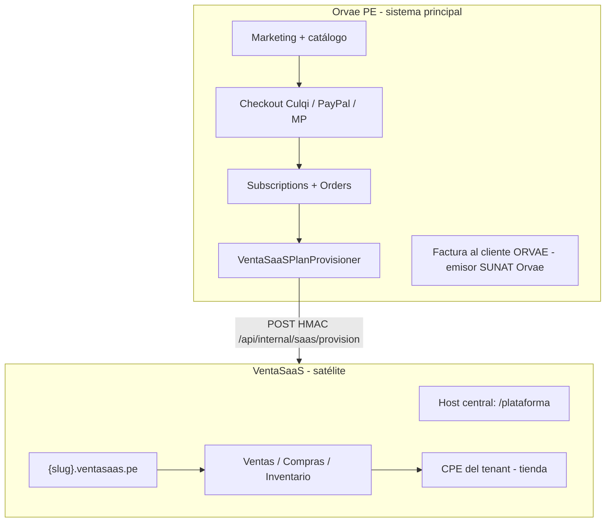
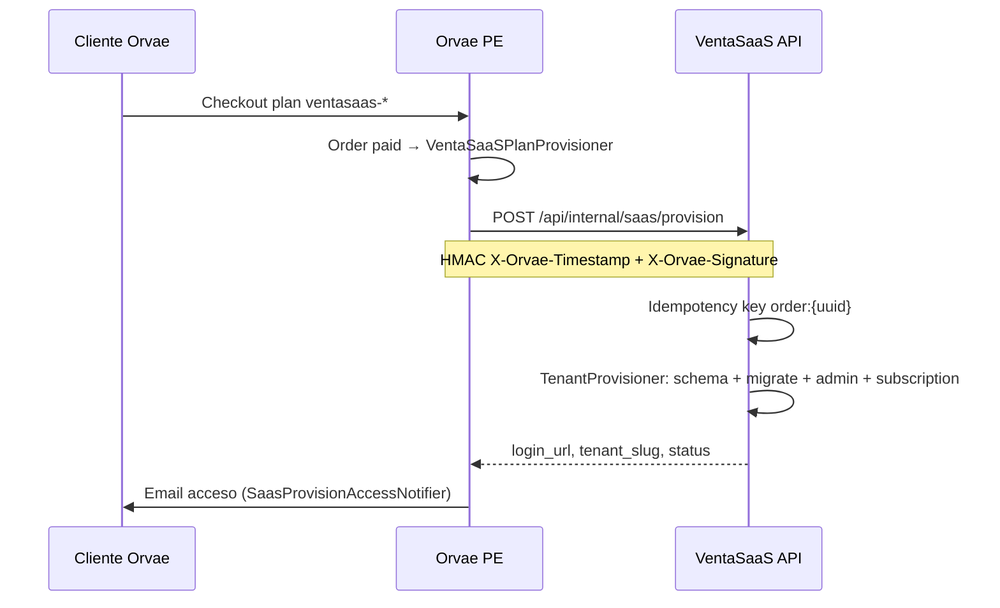
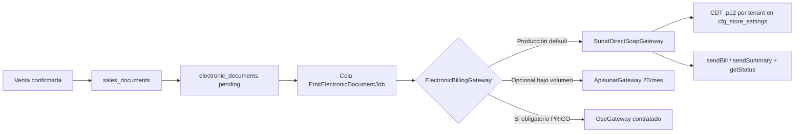
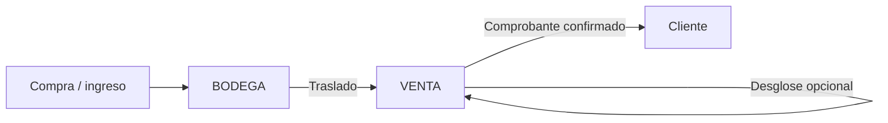
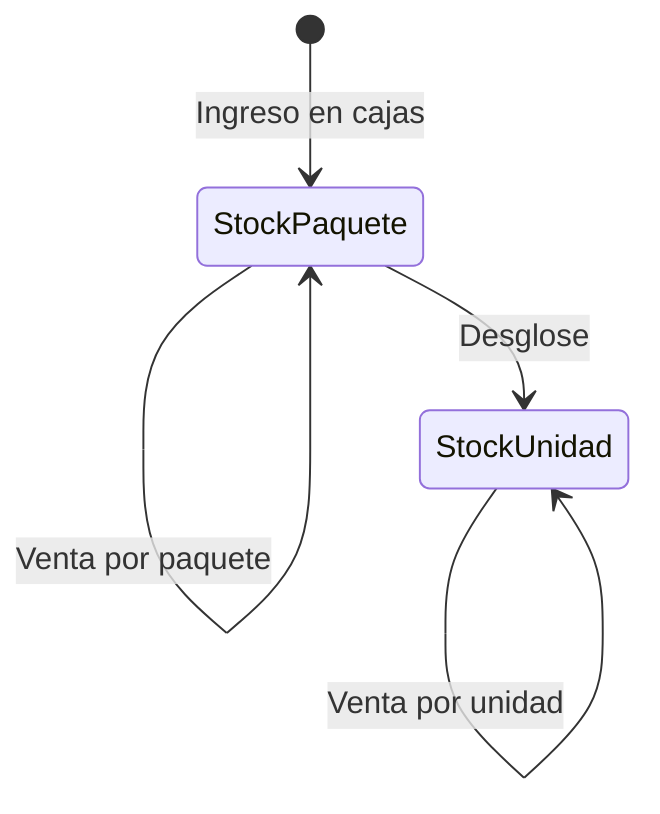

# Arquitectura del sistema — VentaSaaS (retail Perú)

> Documento maestro de solución · Versión: **2.1**  
> Stack: Laravel 13 + Inertia/React + **PostgreSQL multi-schema** + pnpm  
> Referencia: VetSaaS (`../vetsaas/docs/plataforma.md`) · Orvae (`../orvaepe`)  
> **Última actualización operativa:** mayo 2026 — ver [§14 Implementación actual](#14-implementación-actual--erp-admin-fase-1)

---

## 1. Visión y ecosistema

**VentaSaaS** es el satélite operativo para **ventas, compras e inventario** con facturación electrónica Perú. No es el sistema de cobro del SaaS: eso lo hace **Orvae** (proyecto hermano `orvaepe`).



| Sistema | Rol | Cobro SaaS | Datos operativos | CPE tienda |
|---------|-----|------------|------------------|------------|
| **Orvae** | Catálogo, pago, suscripción comercial, alta automática | Sí (pasarelas) | Catálogo SKUs, `orders`, `subscriptions` | Emisor fiscal **ORVAE** |
| **VetaSaaS** | Clínicas veterinarias (patrón hermano) | Vía Orvae | Schema `vet_*` | Nubefact por clínica |
| **VentaSaaS** | Retail / mayorista | Vía Orvae | Schema `venta_*` | **SEE-Contribuyente** (gratis) por defecto |

**Principios (alineados con VetSaaS)**

1. **PostgreSQL multi-schema**: catálogo SaaS en `public`; operación por tenant en `venta_{slug}` (sin `tenant_id` repetido en cada tabla operativa).
2. **Subdominio** `{slug}.{TENANT_ROOT_DOMAIN}` para la tienda; host central para panel `/plataforma/*`.
3. **Single-login**: un `users` en `public`; `users.tenant_id` + middleware `tenant.match-user`.
4. **Planes y features**: `plans` + `plan_features` → límites y flags (`factura_electronica`, productos, sucursales…).
5. **Cobro del SaaS en Orvae**: VentaSaaS solo recibe provisión y refleja `subscriptions` / `subscription_payments` (soporte).
6. **CPE del tenant**: proceso asíncrono en cola; ver [§6 SUNAT](#6-sunat-emisión-sin-pagar-ose-por-defecto).

---

## 2. Modelo multi-tenant (patrón VetSaaS)

### 2.1 Dos capas de datos

```
┌─────────────────────────────────────────────────────────────┐
│ public — identidad y plataforma SaaS                        │
│  users, tenants, plans, plan_features, subscriptions,       │
│  subscription_payments, provision_idempotency_keys, sedes   │
└─────────────────────────────────────────────────────────────┘
         │  tenant.schema_name = venta_mi_tienda
         ▼
┌─────────────────────────────────────────────────────────────┐
│ schema venta_mi_tienda — ERP de la tienda                   │
│  cfg_store_settings, products, stock_*, sales_*, purchases_*│
│  document_series, electronic_documents, parties, …          │
└─────────────────────────────────────────────────────────────┘
```

| Componente | Ubicación en VentaSaaS (a implementar) |
|------------|----------------------------------------|
| `TenantManager` | `app/Tenancy/TenantManager.php` |
| `SubdomainResolver` | `app/Tenancy/Resolvers/SubdomainResolver.php` |
| Middleware | `ResolveTenant`, `EnsureTenant`, `EnsureNoTenant`, `MatchUserTenant` |
| Config | `config/tenant.php` |
| Migraciones globales | `database/migrations/` |
| Migraciones tenant | `database/migrations/tenant/tNNN_*.php` |
| Comando | `php artisan ventasaas:tenant-migrate {schema}` |
| Provisioner | `app/Services/Tenancy/TenantProvisioner.php` |

### 2.2 Hosts

| Entorno | Central (superadmin / staff) | Tenant (tienda) |
|---------|------------------------------|-----------------|
| Local | `localhost`, `ventasaas.test` | `{slug}.localhost` o `{slug}.ventasaas.test` |
| Producción | `app.ventasaas.pe` | `{slug}.ventasaas.pe` |

Variables: `TENANT_CENTRAL_DOMAINS`, `TENANT_ROOT_DOMAIN`, `TENANT_SCHEMA_PREFIX=venta_`.

### 2.3 Fases de despliegue

| Fase | Escenario | Tenancy |
|------|-----------|---------|
| **1 — A medida** | Un cliente, una tienda, entrega on-premise | Un tenant + un schema; puede usarse solo host central con slug fijo |
| **2 — White-label** | Varios clientes, varios deploys | Mismo código; seed/provisión por instalación |
| **3 — SaaS** | Un deploy, muchos tenants | Subdominio + Orvae checkout + panel plataforma |

La Fase 1 **no requiere** Orvae si el contrato es fuera del catálogo; la Fase 3 **sí** reutiliza el flujo de pago ya probado con VetSaaS.

---

## 3. Planes, suscripciones y Orvae

### 3.1 Catálogo en VentaSaaS (`public`)

| Tabla | Uso |
|-------|-----|
| `plans` | `free`, `starter`, `business`, … — precio referencial / espejo del SKU Orvae |
| `plan_features` | `max_products`, `max_branches`, `factura_electronica`, `pos`, `multi_warehouse`, … |
| `subscriptions` | `trial` \| `active` \| `grace` \| `suspended` \| `cancelled` |
| `subscription_payments` | **Solo lectura/soporte** — origen Orvae (`pasarela`, `external_payment_id`) |
| `promo_codes` | Opcional, campañas |
| `platform_settings` | Branding SaaS, mantenimiento |

Capacidades en runtime: `App\Support\PlanCapabilities` (mismo patrón que `vetsaas/app/Support/PlanCapabilities.php`).

### 3.2 Flujo Orvae → VentaSaaS (contrato existente en VetSaaS)



**Implementar en VentaSaaS** (espejo `vetsaas`):

| Pieza | Ruta / archivo |
|-------|----------------|
| API | `routes/api.php` → `POST /api/internal/saas/provision` |
| Middleware | `VerifyOrvaeProvisionSignature` |
| Config | `config/orvae.php` — `ORVAE_PROVISION_HMAC_SECRET` (mismo secret que Orvae `.env`) |
| Normalizer | `App\Support\Orvae\ProvisionPayloadNormalizer` |
| Controller | `App\Http\Controllers\Api\Internal\SaasProvisionController` |
| Tests | `SaasProvisionOrvaeIntegrationTest` |

**Implementar en Orvae** (pendiente en orvaepe):

| Pieza | Referencia VetSaaS |
|-------|-------------------|
| `config/services.php` → `ventasaas` | Bloque `vetsaas` |
| `VentaSaaSPlanProvisioner` | `VetSaaSPlanProvisioner.php` |
| `SaasCatalogSku::isVentasaas()` | `isVetsaas()` |
| SKUs catálogo | `metadata.saas_product: ventasaas`, códigos `ventasaas-*` |
| `.env` | `VENTASAAS_PROVISION_URL`, `VENTASAAS_PROVISION_HMAC_SECRET` |

Payload mínimo (plano, como VetSaaS):

```json
{
  "external_order_id": "uuid-order-orvae",
  "plan_slug": "starter",
  "tenant_slug": "tienda-garcia",
  "razon_social": "García Retail SAC",
  "ruc": "20123456789",
  "admin_name": "Juan García",
  "admin_email": "admin@tienda.com",
  "admin_password": "generada-por-orvae",
  "canal_adquisicion": "orvae"
}
```

### 3.3 Panel Plataforma (`/plataforma/*`)

Permisos Spatie `plataforma-*` (30 permisos, namespace igual que VetSaaS):

- Tenants (CRUD, suspender, impersonar)
- Planes + features
- Suscripciones (trial, cambio plan, cancelar)
- Cobros (consulta, notas soporte — sin pasarela embebida)

Solo usuarios con `tenant_id IS NULL` en host central.

---

## 4. Módulos operativos (schema tenant)

| Módulo | Responsabilidad | Estado Fase 1 (mayo 2026) |
|--------|-----------------|-------------------------|
| **Config tienda** | `cfg_store_settings` — RUC, ubigeo, régimen, credenciales CPE | Parcial (`/admin/configuracion/tienda`) |
| **Catálogo** | Productos, variantes, precios, impuestos, empaque | **Implementado** — ver [§14.2](#142-catálogo-de-productos) |
| **Inventario** | Almacenes, kardex, ajustes, traslados, desglose empaque | **Implementado** — ver [§14.3–14.6](#143-almacenes-bodega-vs-mostrador) |
| **Compras** | Proveedores, OC, recepción, factura compra | Pendiente |
| **Ventas** | Clientes, comprobantes borrador/confirmado | **Parcial** — comprobantes sin CPE aún — [§14.7](#147-ventas--comprobantes) |
| **Tesorería** | Cajas, cobros, pagos | Pendiente |
| **CPE** | Series, XML/CDR, estados (ver §6) | Series CRUD + `electronic_documents` al confirmar; SOAP SUNAT pendiente |
| **SIRE / GRE** | Batch mensual / guías (API SUNAT gratuita, distinto de emisión) | Pendiente |

Detalle de tablas e índices: [`ESTRUCTURA-BASE-DE-DATOS.md`](./ESTRUCTURA-BASE-DE-DATOS.md).  
Detalle funcional y rutas del código actual: [§14](#14-implementación-actual--erp-admin-fase-1).

---

## 5. Capas de aplicación (Laravel)

```
app/
  Tenancy/                    # TenantManager, SubdomainResolver (como vetsaas) — pendiente
  Services/
    Tenancy/TenantProvisioner.php
    Inventory/StockMovementService.php    # ✅ ajustes, venta, traslado, desglose
    Sales/SalesDocumentService.php        # ✅ borrador, líneas, confirmación + stock
    Catalog/ProductPriceFromCostService.php  # ✅ precios desde costo al ajustar stock
    ElectronicBilling/                    # Gateways SUNAT (§6) — pendiente
  Http/Controllers/Admin/
    Catalogo/ …                           # ✅ productos, variantes, precios, empaque
    Inventario/ …                         # ✅ saldos, movimientos, almacenes, traslados
    Ventas/SalesDocumentController.php    # ✅ comprobantes
  Support/
    PlanCapabilities.php
    Orvae/ProvisionPayloadNormalizer.php
  Jobs/
    EmitElectronicDocumentJob.php         # pendiente
    SyncSirePeriodJob.php
```

**Eventos de dominio (objetivo):** `SaleConfirmed`, `StockMoved`, `ElectronicDocumentAccepted`, `TenantProvisioned`.  
Hoy la lógica vive en **servicios** (`StockMovementService`, `SalesDocumentService`) dentro de transacciones DB; eventos explícitos aún no están cableados.

---

## 6. SUNAT: emisión sin pagar OSE por defecto

### 6.1 Qué es gratis y qué no

| Recurso | ¿Cobra SUNAT? | ¿Sirve para emitir factura/boleta en tu ERP? |
|---------|---------------|---------------------------------------------|
| **SEE-SOL** (portal web) | No | No integrable (manual) |
| **SEE-SFS** (Facturador SUNAT desktop) | No | Indirecto (archivos en carpeta `DATA`) |
| **SEE-Contribuyente** (tu software) | No | **Sí** — SOAP + XML UBL + certificado |
| **CDT gratuito SUNAT** | No | Sí — firma digital hasta dic. 2027 ([SUNAT CDT](https://cpe.sunat.gob.pe/certificado-digital)) |
| **API SIRE / GRE** | No | Libros y guías — **no** reemplazan emisión POS |
| **OSE / PSE** (Nubefact, Apisunat, …) | Terceros cobran | REST cómodo; cupos “free” limitados (ej. 20/mes) |

**SUNAT no ofrece un REST público único** tipo “emitir factura con un POST” sin certificado y sin cumplir UBL. La emisión masiva integrada es **SEE del contribuyente** o un **PSE/OSE de pago**.

### 6.2 Estrategia recomendada para VentaSaaS



| Gateway | Cuándo | Costo |
|---------|--------|-------|
| **`SunatDirectSoapGateway`** | Default — control total | $0 SUNAT + CDT gratis; costo = desarrollo |
| **`ApisunatGateway`** | MVP / pruebas rápidas | Plan free 20 CPE/mes, luego ~S/ 8/100 |
| **`OseGateway`** | Cliente PRICO > 300 UIT (desde 07/2025 puede ser obligatorio OSE) | Tarifa del operador |

**Pruebas sin certificado:** usuario SOL `RUC + MODDATOS` / clave `MODDATOS` ([manual programador](https://cpe.sunat.gob.pe/sites/default/files/inline-files/manual_programador%20%281%29.pdf)).

### 6.3 Flujo técnico (igual que v1, gateway concreto)

1. UI confirma venta → `sales_documents` + `electronic_documents.status = pending`.
2. Job: construir UBL 2.1 → firmar con CDT del tenant → ZIP → SOAP `sendBill` (factura) o resumen boletas `sendSummary`.
3. Persistir XML, CDR, hash, códigos SUNAT; exponer PDF impreso opcional.
4. Frontend: polling del estado (nunca certificado en navegador).

**Estados:** `pending` → `building` → `sent` → `accepted` | `rejected` | `observed` → `cancelled`.

### 6.4 SIRE y GRE (complementarios, gratis)

- **SIRE Ventas/Compras:** OAuth `api-seguridad.sunat.gob.pe` → `api-sire.sunat.gob.pe` — job mensual desde comprobantes **aceptados**.
- **GRE:** REST con token SOL — ligado a despacho / `stock_movements`.
- Consumo **solo backend** (CORS en SIRE).

### 6.5 Separación fiscal Orvae vs tenant

| Emisor | Qué factura | Dónde |
|--------|------------|-------|
| **ORVAE** (orvaepe) | Suscripción SaaS al cliente que compró en web | `CompanyLegalProfile`, panel `panel/sunat-emisor` |
| **Tenant** (tienda) | Venta al consumidor / empresa compradora | `electronic_documents` en schema `venta_*` |

No mezclar secuencias ni certificados entre ambos.

### 6.6 Obligatoriedad OSE

Algunos contribuyentes (**PRICO**, ingresos > 300 UIT) deben validar vía **OSE** desde 01/07/2025. El tenant guarda en `cfg_store_settings` el modo `billing_channel: direct_sunat | ose | pse` y el adaptador se elige por configuración + plan (`factura_electronica`).

---

## 7. Frontend (Inertia + React)

| Host | UI |
|------|-----|
| Central | Dashboard plataforma, tenants, planes, suscripciones |
| `{slug}.*` | ERP tienda: ventas, inventario, compras, configuración CPE |

Shared props: `plan_limits`, `plan_features`, `tenant`, `impersonation` (soporte).

Wayfinder + rutas con dominio tenant (como VetSaaS `bootstrap/app.php`).

---

## 8. Infraestructura

| Componente | Elección |
|------------|----------|
| BD | **PostgreSQL 16+** obligatorio (multi-schema) |
| Cola | Redis o `database` — emisión CPE, SIRE |
| Archivos | S3-compatible — XML/CDR/PDF por tenant |
| Cache | Redis — `TenantManager` cache slug → tenant |
| pnpm | Gestor JS del monorepo frontend |

---

## 9. Permisos

### Plataforma (`plataforma-*`)

Superadmin / staff sin `tenant_id`.

### Tenant (por tienda)

Roles sugeridos: `owner`, `admin`, `sales`, `warehouse`, `purchasing`, `accounting`, `cashier` — Spatie en schema `public` con `team_id` = `tenant.id` (UUID) cuando se activen teams.

---

## 10. ADR (decisiones actualizadas)

| ID | Decisión | Motivo |
|----|----------|--------|
| ADR-01 | Multi-schema PostgreSQL (patrón VetSaaS) | Aislamiento fuerte; mismo código que producción SaaS |
| ADR-02 | UUID en `tenants` y tablas `public` | Alineado con Orvae orders/subscriptions |
| ADR-03 | Cobro SaaS solo en Orvae | Un hub de pagos; VentaSaaS no integra Culqi directo |
| ADR-04 | Provisión HMAC idempotente | Contrato probado VetSaaS/Aula Virtual |
| ADR-05 | CPE asíncrono + `ElectronicBillingGateway` | Timeouts SUNAT; swap Sunat SOAP / Apisunat / OSE |
| ADR-06 | Default **SunatDirectSoap** + CDT gratis | Sin fee por documento a terceros |
| ADR-07 | SIRE/GRE batch separado | APIs REST distintas de emisión |
| ADR-08 | Single-login `users.tenant_id` | UX simple; impersonación superadmin |
| ADR-09 | `warehouses.is_saleable` separado de `is_default` | Bodega (stock) vs mostrador (venta) sin mezclar descuentos |
| ADR-10 | Desglose = movimiento `breakdown` entre variantes | Misma bodega física; stock por SKU; venta no convierte empaque automáticamente |
| ADR-11 | `variant_packaging_conversions` por producto | Factor reutilizable en UI de desglose; cantidades editables si no hay regla |

---

## 11. Roadmap técnico

### Bloque A — Plataforma (como VetSaaS)

1. PostgreSQL + `config/tenant.php` + `TenancyServiceProvider`
2. Migraciones `public`: plans, tenants, subscriptions, provision keys
3. Middleware subdominio + panel `/plataforma`
4. API Orvae provision + `TenantProvisioner`
5. Paridad en **orvaepe**: `VentaSaaSPlanProvisioner` + SKUs

### Bloque B — ERP tenant

6. ~~Núcleo catálogo + inventario + comprobantes borrador~~ ✅ (mayo 2026, ver §14) — migraciones aún en `database/migrations/` única (tenant schema pendiente de separar)
7. POS y documentos internos
8. Series + `electronic_documents` + `SunatDirectSoapGateway` (beta MODDATOS) — series ✅, emisión pendiente
9. CDT producción + SIRE batch

### Bloque C — Escala

10. Read replicas, partición `audit_logs`, búsqueda productos

---

## 14. Implementación actual — ERP admin (Fase 1)

> Bloque funcional ya codificado en el monolito `/admin/*` (Inertia + React estilo Choko).  
> **Nota:** el diseño target sigue siendo schema `venta_{slug}` por tenant; hoy muchas tablas viven en la BD del deploy actual hasta activar `Tenancy` completo.

### 14.1 Patrones transversales

| Patrón | Uso |
|--------|-----|
| **Spatie Permission** | Permisos por módulo (`admin.catalogo.*`, `admin.inventario.*`, `admin.ventas.*`, …) |
| **Wayfinder** | Rutas tipadas en TypeScript (`@/routes/admin/...`) |
| **DataTable** | Listados con filtros, paginación, vista móvil |
| **FormSection + FormComboboxField / FormSelectField** | Formularios admin con estilos Choko (`field-styles.ts`) |
| **AppModal** | Modales (`sm` \| `md` \| `lg` \| `xl`); desglose usa `xl` + grid 2 columnas |
| **Toast** | Feedback post-acción (`App\Support\Toast`) |
| **Servicios de dominio** | Lógica de stock y ventas fuera de controladores |

**Componente UI:** `FormComboboxField` — buscador con lista, `menuPlacement: portal` en modales, botón **×** interno (`clearable`, default `true`) para limpiar selección sin borrar con teclado.

### 14.2 Catálogo de productos

#### Rutas principales

| Ruta | Controlador | Acción |
|------|-------------|--------|
| `GET/POST/PUT/DELETE admin/catalogo/productos` | `ProductController` | Listado + alta (modal) + edición vía ficha |
| `GET admin/catalogo/productos/{id}` | `ProductController@show` | Ficha con pestañas |
| `…/variantes`, `…/precios`, `…/perfiles-tributarios` | Controllers dedicados | CRUD por pestaña |
| `POST/DELETE …/conversiones-empaque` | `VariantPackagingConversionController` | Reglas de empaque |
| `POST …/stock` | `StockAdjustmentController@storeForProduct` | Ajuste desde pestaña Stock |

#### Ficha de producto (`show.tsx`)

Pestañas vía query `?tab=`:

| Tab | Contenido |
|-----|-----------|
| `general` | Datos del producto |
| `variantes` | SKUs (unidad, paquete, etc.) |
| `precios` | Precios por lista (catálogo incluye IGV) |
| `impuestos` | Perfiles tributarios por variante |
| `stock` | Saldos por almacén + modal ajuste |
| `empaque` | Conversiones `from_variant → to_variant` con `factor` |

**UX:** crear producto solo en **modal**; editar redirige a la ficha. Tras guardar, redirects usan `to_route(..., ['tab' => '…'])` (trait `RedirectsToProductCatalog`).

#### Ajuste de stock y precios

- Modal **Ajustar stock** desde listado de saldos o ficha producto.
- Opción de **recalcular precios de venta** según nuevo costo (`ProductPriceFromCostService`): porcentaje o soles fijos sobre costo promedio.

### 14.3 Almacenes: bodega vs mostrador

Tabla `warehouses` (campos operativos):

| Campo | Significado |
|-------|-------------|
| `is_active` | Visible en listas y operaciones |
| `is_default` | Preselección en saldos, kardex, stock de producto (solo uno) |
| `is_saleable` | Aparece en **comprobantes de venta** y es destino del descuento al confirmar |

**Patrón retail recomendado:**

| Almacén | `is_default` | `is_saleable` | Rol |
|---------|--------------|---------------|-----|
| **BODEGA** (ej. `MAIN`) | No | **No** | Recepción / reserva; no se vende desde aquí |
| **VENTA** (mostrador) | **Sí** | **Sí** | Stock disponible para facturar |



CRUD: `admin/inventario/almacenes` (`WarehouseController`).

### 14.4 Saldos y kardex

| Pantalla | Ruta | Descripción |
|----------|------|-------------|
| **Saldos por almacén** | `GET admin/inventario/saldos` | Grid por `warehouse_id` + variante; acciones: Ajustar, Trasladar, Desglosar |
| **Kardex** | `GET admin/inventario/movimientos` | Historial `stock_movements` + líneas |

**Stock por variante:** cada SKU tiene su propio `stock_balances` (`quantity_on_hand`, `avg_cost`) por almacén. El producto padre solo agrupa variantes.

### 14.5 Movimientos de inventario (`StockMovementService`)

Tipos en `StockMovement`:

| `movement_type` | Origen | Efecto |
|-----------------|--------|--------|
| `opening` / `adjustment` | Ajuste manual | Entrada/salida en un almacén |
| `purchase_in` | (futuro compras) | Entrada |
| `sale_out` | Confirmar comprobante | Salida del almacén de venta |
| `transfer_out` / `transfer_in` | Traslado | Mismo SKU, dos almacenes |
| `breakdown` | Desglose empaque | Resta SKU origen, suma SKU destino **mismo almacén** |

**Traslados** (`stock_transfers` + `POST admin/inventario/saldos/traslados`):

- Valida stock en origen.
- Crea movimiento salida + entrada enlazados al registro `StockTransfer`.
- Caso típico: **BODEGA → VENTA** (mismas unidades, mismo SKU).

### 14.6 Empaque y desglose

#### Tabla `variant_packaging_conversions`

| Campo | Uso |
|-------|-----|
| `from_variant_id` | SKU “grande” (caja, paquete de 6, display) |
| `to_variant_id` | SKU “chico” (unidad vendible) |
| `factor` | Cuántas unidades destino por 1 unidad origen (ej. `6`) |
| `label` | Texto libre opcional |

Se configura en producto → pestaña **Empaque**. El modal de desglose en Saldos consume estas reglas para autocompletar **cantidad destino**.

#### Desglose (`POST admin/inventario/saldos/desgloses`)

`StockMovementService::breakdownPackaging()`:

1. Mismo `product_id` en ambas variantes.
2. Resta `quantity_from` del balance **origen**.
3. Suma `quantity_to` al balance **destino** (reparte costo: valor total preservado).
4. Un movimiento `breakdown` con dos líneas (+/-).

**No es una venta:** no toca `sales_documents`. Es transformación interna de presentación.

#### Venta por unidad vs por paquete

| Acción | Qué ocurre |
|--------|------------|
| Cliente compra **paquete** | Línea del comprobante con variante **paquete** → descuenta stock de paquetes |
| Cliente compra **unidad** | Línea con variante **unidad** → descuenta stock de unidades |
| Solo hay **paquetes** en mostrador y venden **sueltas** | Primero **desglosar** (1 paquete → N unidades), luego facturar variante unidad |
| Ya hay **unidades** en stock | Facturar directo sin desglosar |



### 14.7 Ventas — comprobantes

| Ruta | Acción |
|------|--------|
| `GET admin/ventas/comprobantes` | Listado |
| `GET admin/ventas/comprobantes/nuevo` | Alta borrador |
| `GET/PUT admin/ventas/comprobantes/{id}` | Editar borrador |
| `POST …/confirmar` | Asigna correlativo de serie + estado `confirmed` |
| `DELETE …` | Borrador |

**Servicio:** `SalesDocumentService`

- Borrador: sincroniza líneas, calcula subtotal/IGV/total (`calculateLine` según perfil tributario de la variante).
- **Confirmar:** reserva número en `document_series`, genera `full_number`, y si hay líneas con `track_stock` llama `postSaleOut` sobre el **almacén del comprobante**.

**Almacén en comprobante:**

- `warehouseOptions`: solo `is_saleable = true` y `is_active`.
- Sin opción “Sin almacén” si existe al menos un almacén vendible.
- `defaultWarehouseId`: el marcado `is_default` entre vendibles (típico **VENTA**).
- Validación `SalesDocumentRequest`: `warehouse_id` debe existir en almacén activo y vendible.

**Precios:** listado de variantes con precio de lista por defecto; totales de línea = cantidad × precio − descuento (precios de catálogo **incluyen IGV**).

**Pendiente:** emisión `electronic_documents`, POS, notas de crédito, reservas.

### 14.8 Socios y documentos

| Módulo | Estado |
|--------|--------|
| **Socios** (`parties`) | CRUD clientes/proveedores + consulta documento |
| **Series** (`document_series`) | CRUD series SUNAT internas (correlativo al confirmar) |

### 14.9 Mapa de archivos clave (referencia rápida)

| Área | Backend | Frontend |
|------|---------|----------|
| Stock | `app/Services/Inventory/StockMovementService.php` | `resources/js/pages/admin/inventario/saldos/index.tsx` |
| Traslado / desglose | `StockTransferController`, `StockBreakdownController` | `stock-transfer-form-modal.tsx`, `stock-breakdown-form-modal.tsx` |
| Producto | `ProductController` + `Concerns/RedirectsToProductCatalog` | `productos/show.tsx`, `product-*-panel.tsx` |
| Empaque | `VariantPackagingConversionController` | `product-packaging-conversions-panel.tsx` |
| Ventas | `SalesDocumentController`, `SalesDocumentService` | `sales-document-form.tsx`, `comprobantes/form.tsx` |
| Formularios | Requests en `app/Http/Requests/Admin/...` | `components/form/form-combobox-field.tsx` |
| Rutas | `routes/admin.php` | Wayfinder generado |

### 14.10 Tests automatizados (inventario / ventas)

- `tests/Feature/Admin/Inventario/StockTransferTest.php`
- `tests/Feature/Admin/Inventario/StockBreakdownTest.php`
- `tests/Feature/Admin/Ventas/SalesDocumentControllerTest.php`
- Tests de `ProductPriceFromCostService` (unit/feature catálogo)

### 14.11 Pendiente inmediato (siguiente oleada)

1. Separar migraciones a `database/migrations/tenant` + `Tenancy` en runtime.
2. Módulo **compras** (recepción → `purchase_in`).
3. **CPE** asíncrono tras confirmar venta (§6).
4. **POS** / cotizaciones.
5. Atajos UX: traslado/desglose desde ficha producto; hints en modal de almacén.

---

## 12. Referencias

### Proyectos hermanos

- VetSaaS plataforma: `D:\Programacion\Laravel\LaraReact\vetsaas\docs\plataforma.md`
- Orvae provisioner: `orvaepe\app\Services\Checkout\VetSaaSPlanProvisioner.php`
- Contrato API: `vetsaas\routes\api.php`, `vetsaas\tests\Feature\Api\SaasProvisionOrvaeIntegrationTest.php`

### SUNAT

- [CPE / OSE](https://cpe.sunat.gob.pe/informacion_general/operador_servicios_electronicos)
- [SEE-SOL gratuito](https://www.gob.pe/7332-sistema-de-emision-electronica-see-sol)
- [Facturador SUNAT SFS](https://cpe.sunat.gob.pe/sistema_emision/facturador_sunat)
- [Certificado Digital Tributario gratuito](https://cpe.sunat.gob.pe/certificado-digital)
- [Manual programador SOAP/UBL](https://cpe.sunat.gob.pe/sites/default/files/inline-files/manual_programador%20%281%29.pdf)
- [SIRE Ventas API](https://cpe.sunat.gob.pe/sites/default/files/inline-files/Manual%20de%20servicios%20Web%20Api%20-%20SIRE_Ventas%20v25.pdf)

### Base de datos

- [`ESTRUCTURA-BASE-DE-DATOS.md`](./ESTRUCTURA-BASE-DE-DATOS.md)

---

## 13. Siguiente entregable

**Plataforma SaaS (Bloque A):**

1. Migraciones capa `public` (tenants, plans, subscriptions).  
2. Núcleo `app/Tenancy/*` copiado/adaptado desde VetSaaS.  
3. Endpoint `POST /api/internal/saas/provision`.  
4. Coordinar SKUs y `VentaSaaSPlanProvisioner` en Orvae.

**ERP tenant (continuación Bloque B — sobre lo ya descrito en §14):**

5. Mover tablas operativas a schema `venta_{slug}`.  
6. Compras + recepción con impacto en kardex.  
7. Emisión electrónica al confirmar comprobante.  
8. POS y tesorería.
