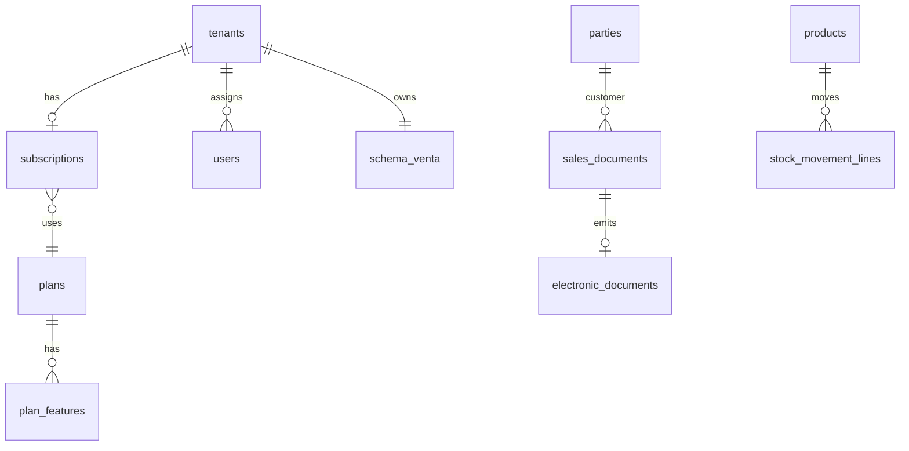

# Estructura de base de datos — PostgreSQL + UUID

> Versión: **2.0** — alineada con [`ARQUITECTURA-SISTEMA.md`](./ARQUITECTURA-SISTEMA.md) y patrón [`vetsaas`](../vetsaas/docs/plataforma.md).  
> Motor: **PostgreSQL 16+** · PK: **UUID** · Multi-tenant: **schema por tienda** (`venta_{slug}`) + catálogo SaaS en **`public`**

---

## 0. Dos capas de esquema (no confundir)

| Capa | Schema | Contenido | Comando migrate |
|------|--------|-----------|-----------------|
| **Plataforma SaaS** | `public` | `tenants`, `plans`, `subscriptions`, `users`, geo, permisos | `php artisan migrate` |
| **ERP tienda** | `venta_{slug}` | productos, ventas, compras, stock, CPE | `php artisan ventasaas:tenant-migrate {schema}` |

**Aislamiento:** en tablas del schema tenant **no** se usa `tenant_id`; el aislamiento es el `search_path`. Excepciones en `public`: `users.tenant_id`, `sedes.tenant_id` (sucursales registradas a nivel plataforma si aplica).

Referencia de tablas `public` en VetSaaS: `vetsaas/database/migrations/2026_05_12_070030` … `070100`.

---

## 1. Convenciones globales

| Regla | Valor |
|-------|--------|
| PK dominio | `uuid` → `DEFAULT gen_random_uuid()` |
| PK `users` (Laravel) | `bigint` + columna `uuid` UNIQUE (compatibilidad Fortify) |
| FK tenant (solo `public`) | `tenant_id uuid REFERENCES tenants(id)` en `users`, `sedes`, etc. |
| Tablas operativas | Schema `venta_*` — **sin** `tenant_id` |
| FK general | `ON DELETE RESTRICT` (salvo pivotes / hijos con CASCADE explícito) |
| Timestamps | `timestamptz` (`created_at`, `updated_at`) |
| Soft delete | `deleted_at` en maestros |
| Dinero | `numeric(18,4)` — nunca `float` |
| Cantidades | `numeric(18,6)` |
| Config flexible | `jsonb` |
| Naming | `snake_case`, tablas plural |
| Índices tenant ERP | por columna de negocio (`sku`, `issue_date`, `status`) — no prefijo `tenant_id` |
| Modelos `public` | trait `UsesPublicSchema` → `public.tabla` |

### 1.1 Extensión PostgreSQL (migración #001)

```sql
CREATE EXTENSION IF NOT EXISTS "pgcrypto";  -- gen_random_uuid()
CREATE EXTENSION IF NOT EXISTS "citext";    -- emails case-insensitive (opcional)
```

### 1.2 Tipos ENUM (PostgreSQL native ENUM o check constraints)

Se recomienda **CHECK** o tablas catálogo para flexibilidad. En este diseño, estados críticos usan `varchar` + check o tabla `statuses`.

---

## 2. Mapa de dominios



---

## 3. Orden de migraciones (CRÍTICO)

Hay **dos pipelines** independientes.

### 3.A — `public` (`php artisan migrate`)

> Copiar orden de `vetsaas/database/migrations/2026_05_12_*`. Adaptar nombres de features (`factura_electronica`, `max_products`, …).

| # | Archivo sugerido | Tablas |
|---|------------------|--------|
| 001 | `create_permission_tables` | Spatie |
| 002–005 | `070010`–`070013` | `paises`, `departamentos`, `provincias`, `distritos` |
| 006 | `070030` | `plans` |
| 007 | `070040` | `plan_features` |
| 008 | `070050` | `promo_codes` |
| 009 | `070060` | **`tenants`** (slug, schema_name, ruc, estado, …) |
| 010 | `070070` | **`subscriptions`** |
| 011 | `070080` | **`subscription_payments`** (soporte Orvae) |
| 012 | `070090` | `global_notifications` |
| 013 | `070100` | **`provision_idempotency_keys`** (Orvae) |
| 014 | `080000` | `sedes` (opcional multi-sede plataforma) |
| 015 | `120000` | `platform_settings` |
| 016 | Laravel + `add_tenant_id_to_users` | `users`, cache, jobs, passkeys |
| 017 | `impersonation_audit_logs` | soporte superadmin |
| 018 | Spatie teams (opcional) | `team_foreign_key` = `tenants.id` |

**`tenants` (campos clave, espejo VetSaaS):** `id`, `slug`, `schema_name`, `razon_social`, `ruc`, `email_admin`, `estado` (`trial|active|suspended|cancelled`), `trial_ends_at`, `canal_adquisicion` (`orvae`), `timezone`, soft deletes.

**`subscriptions`:** `tenant_id`, `plan_id`, `estado`, `starts_at`, `ends_at`, `external_order_id` (Orvae), índice único activo por tenant.

### 3.B — Schema tenant (`database/migrations/tenant/tNNN_*.php`)

Ejecutar: `php artisan ventasaas:tenant-migrate venta_mi_tienda`  
Base class: `TenantMigration` (como `vetsaas`).

| Prefijo | Tablas |
|---------|--------|
| **t010** | `cfg_store_settings` (RUC, ubigeo, `billing_channel`, CDT cifrado, ambiente sunat) |
| **t020** | Catálogos SUNAT locales si no están solo en public |
| **t030** | `units`, `tax_rates` (si son por tienda) |
| **t040** | `parties`, `party_addresses` |
| **t050–054** | `product_categories`, `products`, `variants`, `prices`, `tax_profiles` |
| **t060–065** | `warehouses`, `stock_movements`, `lines`, `balances`, `reservations` |
| **t070–071** | `document_series`, `document_number_sequences` |
| **t080–085** | Compras: OC, recepciones, facturas compra |
| **t090–096** | Ventas: quotes, orders, `sales_documents`, lines, links |
| **t100–103** | `electronic_documents`, `events`, `summary_documents` |
| **t110–113** | Tesorería: métodos pago, cajas, `payments`, allocations |
| **t120–121** | `sire_period_submissions`, `dispatch_guides` (GRE) |
| **t130** | `audit_logs` (por schema) |

> Las migraciones Laravel existentes del starter (`users`, `cache`, `jobs`, `permission`) viven en `public` y corren **antes** del bloque `070030+`.

---

## 4. Tablas detalladas — capa `public` (plataforma)

### 4.1 `plans` / `plan_features`

| `plans` | `code` UNIQUE (`free`, `starter`, `business`), `name`, `price_monthly`, `is_active` |
| `plan_features` | `plan_id`, `feature_key`, `value` (string/number/bool) |

Features VentaSaaS sugeridos (catálogo en código, como VetSaaS `FEATURE_CATALOG`):

- `max_products`, `max_branches`, `max_users`
- `pos`, `multi_warehouse`, `purchasing`
- `factura_electronica`, `gre`, `sire_sync`

### 4.2 `tenants`

Ver migración espejo `vetsaas/2026_05_12_070060_create_tenants_table.php`. Campos críticos: `slug`, `schema_name` (`venta_{slug}`), `estado`, vínculo Orvae vía `subscriptions.external_order_id`.

### 4.3 `subscriptions` / `subscription_payments`

- **subscriptions:** relación tenant ↔ plan; estados con CHECK; un activo por tenant (índice parcial).
- **subscription_payments:** reflejo de cobros Orvae (`pasarela`, `monto`, `estado`, `external_payment_id`) — **no** crear pagos desde VentaSaaS.

### 4.4 `provision_idempotency_keys`

| Columna | Uso |
|---------|-----|
| `key` | `X-Idempotency-Key` de Orvae (`order:{uuid}`) |
| `response_hash` / `payload` | Evitar doble alta de tenant |

### 4.5 `users` (single-login)

| Columna | Uso |
|---------|-----|
| `tenant_id` | NULL = staff plataforma; UUID = usuario de esa tienda |
| `uuid` | Exposición API |

**Índices:** `UNIQUE (tenant_id, email)` donde aplica.

---

## 5. Tablas detalladas — schema tenant (`venta_*`)

> **Sin `tenant_id`** en las tablas siguientes. Configuración de tienda en `cfg_store_settings` (reemplaza `tenant_settings` + credenciales CPE).

### 5.1 `cfg_store_settings`

| Columna | Tipo | Notas |
|---------|------|--------|
| `id` | uuid PK | fila única o por branch |
| `branch_id` | uuid nullable | |
| `ruc`, `razon_social`, `ubigeo`, `direccion` | | |
| `tax_regime` | varchar | |
| `billing_channel` | varchar | `direct_sunat`, `pse`, `ose` |
| `sunat_environment` | varchar | `beta`, `production` |
| `cdt_path_enc`, `cdt_password_enc` | text | CDT gratuito SUNAT |
| `apisunat_token_enc` | text nullable | solo si gateway PSE |
| `default_igv_rate` | numeric | |
| `settings` | jsonb | |

### 5.2 `branches` (sucursales — dentro del schema tenant)

| Columna | Tipo |
|---------|------|
| `id` | uuid PK |
| `code` | varchar(20) |
| `name` | varchar(255) |
| `ubigeo` | char(6) |
| `address` | text |
| `warehouse_id` | uuid FK nullable |
| `is_main` | boolean |
| `status` | varchar(20) |
| timestamps + soft delete | |

**Índices:** `UNIQUE (code)`, `INDEX (status)`

---

### 5.3 Catálogos SUNAT (globales en `public` o replicados en tenant)

#### `sunat_document_types`
`code` char(2) PK — `01` Factura, `03` Boleta, `07` NC, `08` ND, `09` GRE, …

#### `sunat_identity_document_types`
`code` varchar(1) — `1` DNI, `6` RUC, …

#### `sunat_tax_affectations`
`code` varchar(2) — `10` gravado, `20` exonerado, `30` inafecto, …

#### `ubigeo`
`code` char(6) PK, `department`, `province`, `district` — datos INEI

---

### 5.4 `currencies` / `exchange_rates`

**currencies:** `code` char(3) PK (`PEN`, `USD`)

**exchange_rates:**

| Columna | Tipo |
|---------|------|
| `id` | uuid PK |
| `tenant_id` | uuid FK nullable en `public` — null = tipo cambio SUNAT global |
| `currency_code` | char(3) |
| `date` | date |
| `buy_rate`, `sell_rate` | numeric(18,6) |
| timestamps | |

**Índices:** `UNIQUE (tenant_id, currency_code, date)`, `INDEX (date)`

---

### 5.5 `parties` (clientes y proveedores unificados)

| Columna | Tipo |
|---------|------|
| `id` | uuid PK |
| `type` | varchar(20) | `customer`, `supplier`, `both` |
| `document_type` | varchar(1) |
| `document_number` | varchar(15) |
| `legal_name` | varchar(255) |
| `trade_name` | varchar(255) nullable |
| `email`, `phone` | varchar |
| `credit_limit` | numeric(18,4) default 0 |
| `payment_term_days` | int default 0 |
| `status` | varchar(20) |
| timestamps + soft delete | |

**Índices:**
- `UNIQUE (document_type, document_number)` dentro del schema
- `INDEX (type, status)`
- `GIN` opcional en `legal_name` con `pg_trgm` para búsqueda

---

### 5.6 Productos

#### `product_categories`
`id`, `parent_id` self FK, `name`, `path` ltree opcional, soft delete

#### `products`
| Columna | Tipo |
|---------|------|
| `id` | uuid PK |
| `category_id` | uuid FK |
| `type` | varchar(20) | `good`, `service` |
| `name` | varchar(255) |
| `description` | text |
| `track_stock` | boolean |
| `base_unit_id` | uuid FK → units |
| `status` | varchar(20) |
| timestamps + soft delete | |

#### `product_variants`
SKU por tenant, barcode, `product_id`, atributos jsonb

**Índices:** `UNIQUE (sku)`, `INDEX (product_id)`, `INDEX (barcode)` where not null

#### `product_prices`
`variant_id`, `price_list` (`default`, `wholesale`), `currency_code`, `amount`, vigencia `valid_from` / `valid_to`

#### `product_tax_profiles`
`variant_id`, `sunat_affectation_code`, `igv_rate`, `isc` opcional

---

### 5.7 Inventario

#### `warehouses`
`branch_id`, `code`, `name`, `is_saleable`

#### `stock_movements` (cabecera kardex)
| Columna | Tipo |
|---------|------|
| `id` | uuid PK |
| `warehouse_id` | uuid FK |
| `movement_type` | varchar(30) | `purchase_in`, `sale_out`, `transfer_in`, `transfer_out`, `adjustment`, `opening` |
| `reference_type` | varchar(50) | morph |
| `reference_id` | uuid |
| `document_number` | varchar(30) |
| `movement_date` | timestamptz |
| `status` | varchar(20) | `posted`, `cancelled` |
| `notes` | text |
| `created_by` | bigint FK users |
| timestamps | |

**Índices:** `INDEX (warehouse_id, movement_date DESC)`, `INDEX (reference_type, reference_id)`

#### `stock_movement_lines`
`movement_id`, `variant_id`, `quantity`, `unit_cost`, `total_cost`

#### `stock_balances` (desnormalizado para lectura rápida)
`warehouse_id`, `variant_id`, `quantity_on_hand`, `quantity_reserved`, `avg_cost`

**Índices:** `UNIQUE (warehouse_id, variant_id)` — actualizar por trigger o job

#### `stock_reservations`
Para pedidos no despachados: `variant_id`, `warehouse_id`, `quantity`, `reference` morph, `expires_at`

---

### 5.8 Series y numeración

#### `document_series`
| Columna | Tipo |
|---------|------|
| `id` | uuid PK |
| `branch_id` | uuid FK |
| `sunat_document_type_code` | char(2) |
| `series` | varchar(4) | ej. `F001`, `B001` |
| `is_electronic` | boolean |
| `next_number` | bigint | **usar con lock** |
| `status` | varchar(20) |
| timestamps | |

**Índices:** `UNIQUE (branch_id, sunat_document_type_code, series)`

#### `document_number_sequences` (alternativa robusta)
`id`, `series_id`, `last_number` — actualización `UPDATE … RETURNING` en transacción

---

### 5.9 Compras

#### `purchase_orders` + `purchase_order_lines`
Estados: `draft`, `approved`, `partially_received`, `closed`, `cancelled`

#### `goods_receipts` + lines
Vincula `purchase_order_line_id`, incrementa stock al `posted`

#### `purchase_invoices` + lines
`supplier_party_id`, totales, `currency_code`, `exchange_rate`, vínculo opcional a CPE del proveedor (`supplier_document_number`)

**Índices compras:** `INDEX (supplier_party_id, issue_date DESC)`, `INDEX (status)`

---

### 5.10 Ventas (tabla unificada de comprobantes)

#### `sales_documents`
Documento comercial y tributario (antes de o además del XML).

| Columna | Tipo |
|---------|------|
| `id` | uuid PK |
| `branch_id` | uuid FK |
| `series_id` | uuid FK → document_series |
| `sunat_document_type_code` | char(2) |
| `series` | varchar(4) |
| `number` | bigint |
| `full_number` | varchar(20) | `F001-00012345` generado |
| `customer_party_id` | uuid FK |
| `issue_date` | date |
| `due_date` | date nullable |
| `currency_code` | char(3) |
| `exchange_rate` | numeric(18,6) default 1 |
| `subtotal`, `tax_amount`, `total` | numeric(18,4) |
| `global_discount` | numeric(18,4) |
| `status` | varchar(30) | `draft`, `confirmed`, `voided` |
| `payment_status` | varchar(20) | `unpaid`, `partial`, `paid` |
| `source` | varchar(20) | `erp`, `pos`, `api` |
| `sales_order_id` | uuid nullable |
| `notes` | text |
| `created_by` | bigint |
| timestamps + soft delete | |

**Índices (alto volumen por schema):**
```sql
UNIQUE (sunat_document_type_code, series, number)
INDEX (issue_date DESC)
INDEX (customer_party_id, issue_date DESC)
INDEX (status) WHERE status <> 'voided'
INDEX (branch_id, issue_date DESC)
```

#### `sales_document_lines`
`variant_id`, `description`, `quantity`, `unit_price`, `discount`, `tax_affectation`, `igv_amount`, `line_total`, `warehouse_id` para despacho

#### `sales_document_links`
`document_id`, `related_document_id`, `link_type` (`credit_note`, `debit_note`, `reference`)

---

### 5.11 Facturación electrónica (CPE)

Credenciales en **`cfg_store_settings`** (CDT, `billing_channel`, tokens PSE opcionales). No tabla separada obligatoria.

#### `electronic_documents`
| Columna | Tipo |
|---------|------|
| `id` | uuid PK |
| `sales_document_id` | uuid FK UNIQUE |
| `gateway` | varchar(30) | `sunat_soap`, `apisunat`, `ose` |
| `ubl_version` | varchar(10) |
| `xml_hash` | char(64) |
| `xml_path` | text |
| `cdr_path` | text nullable |
| `sunat_ticket` | varchar(50) nullable — resúmenes |
| `sunat_response_code` | varchar(10) |
| `sunat_description` | text |
| `status` | varchar(30) |
| `sent_at`, `accepted_at` | timestamptz |
| `retry_count` | int |
| timestamps | |

**Índices:** `INDEX (status)`, `INDEX (sent_at DESC)`, `INDEX (sales_document_id)`

#### `electronic_document_events`
Log append-only: `electronic_document_id`, `event`, `payload` jsonb, `created_at`

#### `electronic_summary_documents`
Resumen diario de boletas (RA/RC): `summary_date`, `status`, `xml_path`, `ticket`

---

### 5.12 Tesorería

#### `payment_methods`
`code` (`cash`, `card`, `transfer`, `yape`), `name`

#### `cash_registers`
Por branch, sesión de caja (`cash_register_sessions`): apertura/cierre

#### `payments`
`party_id`, `direction` (`in` cobro, `out` pago), `amount`, `payment_method_id`, `reference`

#### `payment_allocations`
`payment_id`, `payable_type`, `payable_id` (sales_document / purchase_invoice), `amount`

---

### 5.13 SIRE y GRE (fase batch)

#### `sire_period_submissions`
`book_type` (`sales`, `purchases`), `period` char(6) `YYYYMM`, `status`, `submission_payload` jsonb

#### `dispatch_guides` (GRE)
`branch_id`, `series`, `number`, `carrier_data` jsonb, `linked_stock_movement_id`, `electronic_status`

---

### 5.14 `audit_logs` (schema tenant)

| Columna | Tipo |
|---------|------|
| `id` | uuid PK |
| `user_id` | bigint nullable |
| `auditable_type` | varchar(100) |
| `auditable_id` | uuid |
| `event` | varchar(30) |
| `old_values`, `new_values` | jsonb |
| `ip_address` | inet |
| `user_agent` | text |
| `created_at` | timestamptz |

**Índices:** `INDEX (auditable_type, auditable_id)`, `INDEX (created_at DESC)`

**Particionamiento futuro:** `PARTITION BY RANGE (created_at)` mensual cuando supere ~50M filas.

---

## 6. Estrategia de índices para SaaS masivo

### 6.1 Regla de oro (multi-schema)

> El aislamiento es el **schema**. Cada consulta ERP corre con `search_path` al schema del tenant. Los índices optimizan columnas de negocio (`issue_date`, `sku`, `status`), no `tenant_id`.

En `public`, las listas de plataforma sí filtran por `tenants.estado`, `subscriptions.tenant_id`, etc.

### 6.2 Índices parciales

```sql
CREATE INDEX idx_sales_open ON sales_documents (issue_date DESC)
  WHERE status IN ('confirmed') AND deleted_at IS NULL;
```

### 6.3 Índices para integración SUNAT

- `electronic_documents (status)` WHERE `status = 'pending'` — worker de cola por schema
- `sales_documents (sunat_document_type_code, issue_date)` — resumen diario boletas

### 6.4 Escalado horizontal futuro

| Técnica | Cuándo |
|---------|--------|
| Read replicas | Reportes pesados |
| Schema por tenant (ya aplicado) | Aislamiento natural |
| Partición temporal en `audit_logs` | >100M registros por schema |
| PgBouncer | Muchas instancias PHP |

---

## 7. Integridad y transacciones

| Operación | Regla |
|-----------|--------|
| Confirmar venta | TX: documento + líneas + reserva stock + movimiento kardex + job CPE |
| Numeración | `SELECT … FOR UPDATE` en `document_series` o tabla `sequences` |
| Anular venta | NC electrónica + reversión kardex; nunca DELETE físico del documento |
| Cierre de caja | Bloquear edición de pagos de esa sesión |

---

## 8. Seeders mínimos (orden)

**`public`:** `PlansAndFeaturesSeeder`, geo Perú, `PermissionsSeeder` (`plataforma-*`), superadmin.

**Por tenant (tras `TenantProvisioner`):** catálogos SUNAT, monedas, `cfg_store_settings`, series F001/B001, admin user con `tenant_id`.

---

## 9. Relación con migraciones Laravel existentes

- Starter: `users`, `cache`, `jobs`, `passkeys`, `permission_tables` (SQLite hoy → migrar a **pgsql**).
- Añadir bloque plataforma `070030+` (§3.A).
- Carpeta `database/migrations/tenant/` (§3.B).

---

## 10. Checklist antes de codificar migraciones

- [ ] PostgreSQL 16+ y `DB_CONNECTION=pgsql`
- [ ] Pipeline §3.A (`public`) antes que tenant
- [ ] `TenantMigration` + comando `ventasaas:tenant-migrate`
- [ ] Tablas ERP **sin** `tenant_id` en schema tenant
- [ ] `plans` / `subscriptions` / `provision_idempotency_keys` para Orvae
- [ ] `cfg_store_settings.billing_channel` + CDT
- [ ] Endpoint `/api/internal/saas/provision` probado con secret compartido Orvae

---

## 11. Diagrama de dependencias (lectura rápida)

```
public.tenants
  → public.subscriptions → public.plans
  → public.users (tenant_id)
  → schema venta_* (migrate tenant)
       → cfg_store_settings, parties, products, stock_*, sales_*, electronic_documents
```

---

*Documento vivo: al implementar cada migración, marcar en este archivo o en un `MIGRATIONS-LOG.md` la fecha real de aplicación.*
